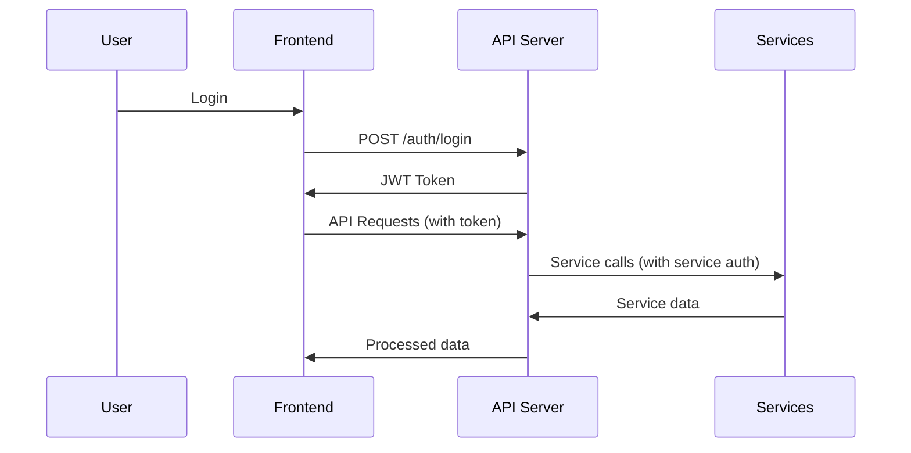

# Homelab Integration Architecture

## 🏗️ System Architecture Overview

Your homelab dashboard follows a three-tier architecture designed for real-world deployment:

```
┌─────────────────────┐    ┌─────────────────────┐    ┌─────────────────────┐
│   Frontend Dashboard│    │    API Server       │    │  Homelab Services   │
│   (React App)       │◄──►│   (Node.js/Python)  │◄──►│   (NAS, Docker,     │
│   This Project      │    │   Separate Project  │    │    Proxmox, etc.)  │
└─────────────────────┘    └─────────────────────┘    └─────────────────────┘
```

## 🎯 Why This Architecture?

### Separation of Concerns
- **Frontend**: UI/UX, state management, user interactions
- **API Server**: Business logic, authentication, service orchestration
- **Services**: Actual homelab hardware and applications

### Security Benefits
- API server acts as a secure gateway
- Services never directly exposed to the internet
- Centralized authentication and authorization
- Rate limiting and request validation

### Scalability
- Frontend can be deployed to CDN
- API server can be scaled horizontally
- Services remain independent

## 🔧 Component Responsibilities

### Frontend Dashboard (This Project)
```javascript
// What it does:
- User interface and experience
- State management (React Context)
- Real-time data display
- Chart rendering and visualization
- User preference management

// What it doesn't do:
- Direct hardware communication
- Authentication (beyond storing tokens)
- Complex business logic
- Data persistence (beyond caching)
```

### API Server (Separate Project)
```javascript
// What it does:
- Service discovery and health checks
- Data aggregation and transformation
- Authentication and authorization
- Rate limiting and security
- WebSocket connections for real-time updates
- Caching and performance optimization

// Technologies:
- Node.js with Express/Fastify
- Python with FastAPI/Django
- Go with Gin/Echo
- Database: PostgreSQL/MongoDB
```

### Homelab Services
```javascript
// Examples:
- Synology/QNAP NAS APIs
- Docker Engine API
- Proxmox VE API
- Pi-hole API
- Home Assistant API
- Custom microservices
```

## 📡 Communication Patterns

### REST API Communication
```javascript
// Frontend → API Server
fetch('/api/nas/storage')
  .then(response => response.json())
  .then(data => updateDashboard(data));

// API Server → NAS
const nasClient = new SynologyAPI(config);
const storageData = await nasClient.getStorageInfo();
```

### WebSocket Real-time Updates
```javascript
// Frontend WebSocket client
const ws = new WebSocket('ws://api-server:3001/realtime');
ws.on('nas-update', (data) => {
  updateNASMetrics(data);
});

// API Server WebSocket server
io.on('connection', (socket) => {
  // Poll NAS every 5 seconds
  setInterval(async () => {
    const data = await nasAPI.getCurrentStats();
    socket.emit('nas-update', data);
  }, 5000);
});
```

## 🔐 Security Architecture

### Authentication Flow


### Security Layers
1. **Frontend**: Token storage, HTTPS enforcement
2. **API Server**: JWT validation, role-based access
3. **Network**: VPN, firewall rules, internal-only services
4. **Services**: Service-specific authentication

## 📁 Project Structure Example

### Your Current Frontend Project
```
task-manager/
├── src/
│   ├── components/homelab/     # Dashboard components
│   ├── context/               # State management
│   ├── hooks/                 # Custom hooks
│   └── utils/                 # Utilities
├── docs/                      # This documentation
└── package.json
```

### Suggested API Server Project
```
homelab-api-server/
├── src/
│   ├── controllers/           # Route handlers
│   ├── services/              # Business logic
│   ├── integrations/          # Service adapters
│   ├── middleware/            # Auth, validation
│   └── models/                # Data models
├── config/                    # Configuration
├── docker/                    # Docker setup
└── package.json
```

## 🚀 Deployment Architecture

### Development Environment
```
Docker Compose:
├── frontend (React dev server)
├── api-server (Node.js)
├── database (PostgreSQL)
└── mock-services (for testing)
```

### Production Environment
```
┌─────────────────┐
│   Load Balancer │
│   (nginx/traefik)│
└─────────┬───────┘
          │
    ┌─────▼─────┐    ┌─────────────┐
    │ Frontend  │    │ API Server  │
    │ (CDN/S3)  │    │ (Docker)    │
    └───────────┘    └─────┬───────┘
                           │
                    ┌──────▼──────┐
                    │  Database   │
                    │ (PostgreSQL)│
                    └─────────────┘
```

## 🔄 Data Flow Examples

### NAS Storage Monitoring
```javascript
// 1. Frontend requests data
useEffect(() => {
  homelabApi.getNASStorage()
    .then(setStorageData);
}, []);

// 2. API server processes request
app.get('/api/nas/storage', async (req, res) => {
  const rawData = await synologyAPI.getStorageInfo();
  const processedData = transformStorageData(rawData);
  res.json(processedData);
});

// 3. Service integration
class SynologyAdapter {
  async getStorageInfo() {
    return await this.client.get('/webapi/entry.cgi', {
      params: { api: 'SYNO.Core.System.Storage' }
    });
  }
}
```

### Real-time Docker Container Updates
```javascript
// WebSocket event flow
Frontend ←WebSocket→ API Server ←Polling→ Docker API

// API Server polls Docker every 5 seconds
setInterval(async () => {
  const containers = await docker.listContainers();
  io.emit('container-update', containers);
}, 5000);
```

## 📊 Monitoring and Observability

### Metrics Collection
- **Frontend**: User interactions, performance metrics
- **API Server**: Request rates, response times, error rates
- **Services**: Service-specific metrics

### Health Checks
```javascript
// API Server health endpoint
app.get('/health', async (req, res) => {
  const health = {
    status: 'healthy',
    services: {
      nas: await checkNASHealth(),
      docker: await checkDockerHealth(),
      database: await checkDBHealth()
    }
  };
  res.json(health);
});
```

## 🎯 Next Steps

1. **Read**: [api-server-setup.md](./api-server-setup.md) - Learn how to create the API server
2. **Implement**: [nas-integration.md](./nas-integration.md) - Start with NAS integration
3. **Expand**: Add more services using established patterns
4. **Deploy**: Use deployment guides for production setup

## 🔗 Related Documentation

- [API Server Setup Guide](./api-server-setup.md)
- [NAS Integration Guide](./nas-integration.md)
- [Service Integration Patterns](./service-integrations/)
- [Security Best Practices](./security/)
- [Deployment Guides](./deployment/)
